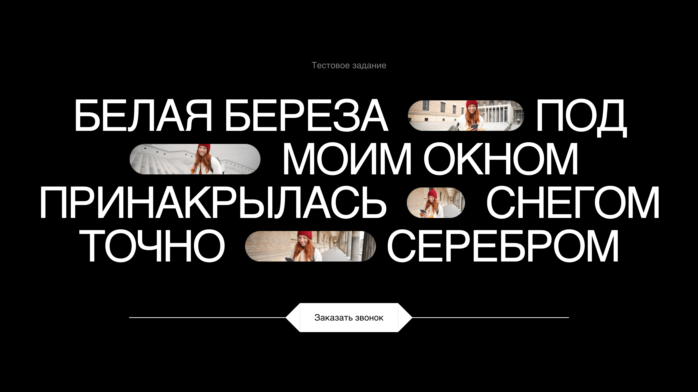

# Тестовое задание для 12studio

[Ссылка на GitHub Pages](https://yaroslav-chertov.github.io/white_birch/)

[Ссылка на макет Figma](https://www.figma.com/design/EcuMBowopesHHrrUng7crf/%D0%A2%D0%B5%D1%81%D1%82%D0%BE%D0%B2%D0%BE%D0%B5-%D0%B7%D0%B0%D0%B4%D0%B0%D0%BD%D0%B8%D0%B5--frontend-?node-id=1-2&t=Yp5oGYEqmO2xCdMk-1)

## Описание и функциональность

Блок на странице реализован в рамках тестового задания строго по макету и требованиям ТЗ. Адаптивность не предусмотрена, так как не требуется по ТЗ.



## Инструкция по установке:

```
git clone https://github.com/Yaroslav-Chertov/white_birch.git
```

Затем запустить локальный сервер.
